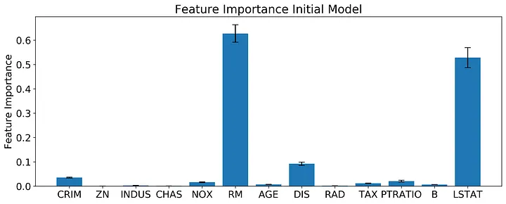
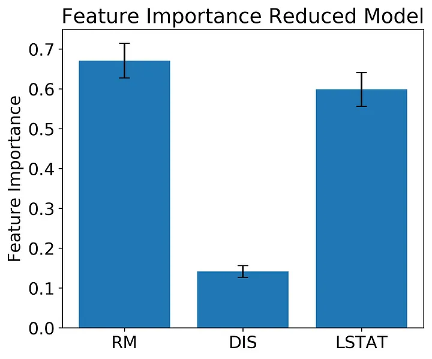
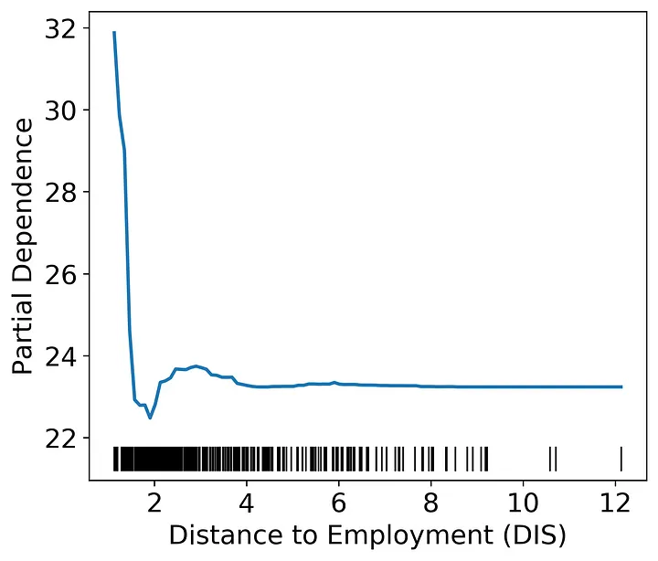
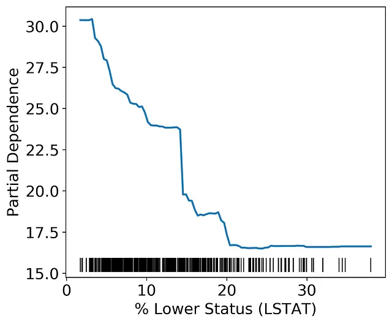
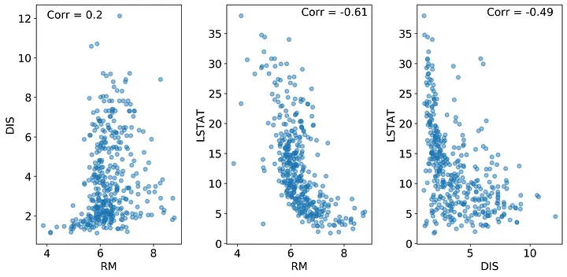
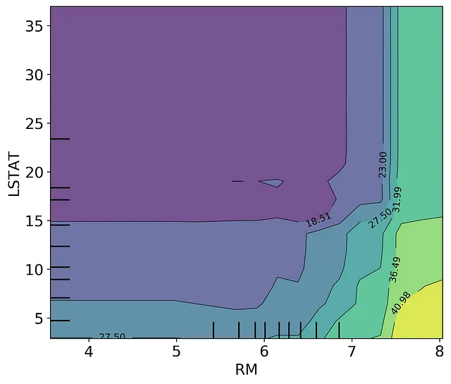
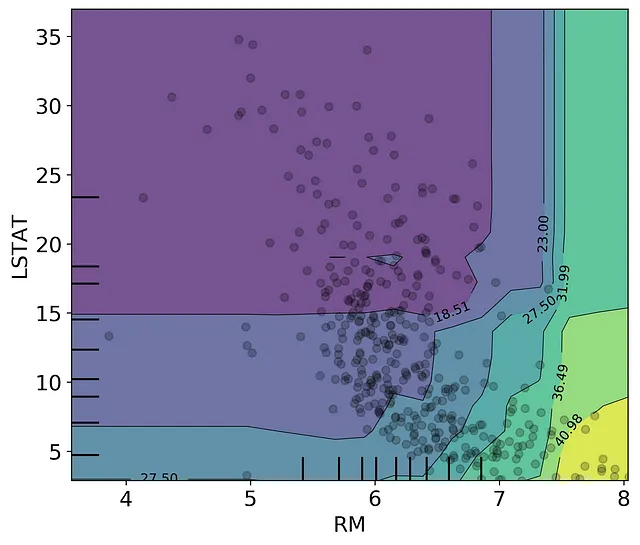

# Looking Beyond Feature Importance
## How to use Partial Dependence Plots in Python

Many articles discuss how to use feature importance for selecting features and analyzing your machine learning model. What happens when you have selected your important features and rerun your model? Feature importance is incredibly useful for understanding what is driving our model, but it does not tell us how that feature is related to the model predictions. This article covers how to step beyond feature importance and use plotting methods to gain a deeper understanding of how the features in your models are driving model predictions.

### Feature Importance

Before we go beyond feature importance, we need to define feature importance and discuss when how we would use it.
At the highest level, feature importance is a measure of how much influence a specific predictor variable (a feature) has on the accuracy of the model prediction. You can use feature importance to prune your model and reduce overfitting by dropping the low performing features.
If you use scikit-learn (sklearn), the default method of calculating feature importance depends a bit on the type of model you are building. For example, I'll be using a random forest regression model in this article. The default feature importance from sklearn for a random forest model is calculated by [normalizing the fraction of samples each feature helps predict by the "decrease in impurity" from splitting that feature](https://medium.com/r/?url=https%3A%2F%2Fscikit-learn.org%2Fstable%2Fmodules%2Fensemble.html%23feature-importance-evaluation). Whereas to get the feature importance of a linear model (linear regression, logistic regression) you can look at the parameter coefficient values scaled by the standard deviation of the feature.
Personally, I prefer model agnostic methods of feature importance. The default sklearn random forest feature importance is rather difficult for me to grasp, so instead, I use a permutation importance method. Sklearn implements a permutation importance method, where the importance of a features is determined by randomly permuting the data in each feature and calculating the mean difference in MSE (or score of your choice) relative to the baseline. This type of feature importance has a greater computational load, but can be done across different types of models, which is nice for standardizing your modelling approach.
Often, we can stop once we've found a reasonable feature set that accurately predicts our response variable. However, sometimes it's useful to gain a deeper understanding of how our models and our systems work. To do so, we'll need a separate method to extract the relationship between features and the response variable.
Now the question remains, where do we go from here?

### Partial Dependence Plots: The Next Generation
You can tell from my earlier articles that I am a big fan of using plots and visualizations to understand relationships in my data. In most cases, visual inspection methods are applicable across a wide range of data distributions and methods. For machine learning, one of the most straightforward ways to determine the relationship of features with the response variables is with a partial dependence plot (PDP).
Constructing a PDP is pretty intuitive:
Select your feature of interest (FOI)
For continuous FOIs: 
- Create a sequence ranging from the minimum to the maximum of the feature
For categorical FOIS: 
- Create a dummy variable for each level (n-1) in your categorical feature
Replace every value in your FOI with a value from your sequence.
Get the predictions from this new feature set and average over all the predictions. Store that average in a vector.
Repeat steps 3 and 4 for every value in your feature sequence
Plot the average predictions against the feature sequence itself

There are [mathematical](https://christophm.github.io/interpretable-ml-book/pdp.html) descriptions of this algorithm. In essence, this algorithm does is show the marginal effect of our FOI on the model predictions.
In the rest of this article, I will show you how to construct PDPs and how to interpret them. I'll show you how to use sklearn to create these plots and how to construct them directly yourself. I'll wrap up at the end with a discussion of the potential pitfalls to look out for when using a PDP and how to solve these problems.

****

### One dimensional Partial Dependence Plots
#### Read in and split the Data
For this analysis, I'll be doing a random forest regression using the Boston Housing Dataset in the scikit-learn package.

```
import pandas as pd
import numpy as np
import matplotlib.pyplot as plt
from sklearn.datasets import load_boston

boston_data = load_boston()
X = pd.DataFrame(boston_data.data, columns=boston_data.feature_names)
Y = pd.Series(boston_data.target)

from sklearn.model_selection import train_test_split
X_train, X_test, Y_train, Y_test = train_test_split(X, Y, test_size = 0.2, random_state=42)
```

There are 13 features in the Boston Housing Dataset, you can read about them here. After we do some preliminary feature selection I’ll break down what the more important features represent. The target variable in this dataset is the “median value of owner-occupied homes in $1000”. So essentially, the task here is to predict housing prices based off of a set of features.

#### Build the initial model
After reading in the data I created a random forest regressor. I chose maximum tree depth and the number of estimators that gave good model performance and did not engage in any hyperparameter tuning.

```
from sklearn.ensemble import RandomForestRegressor
regr = RandomForestRegressor(max_depth = 5, random_state = 42, n_estimators = 100)
regr.fit(X_train, Y_train)

default_importance = regr.feature_importances_

from sklearn.inspection import permutation_importance
perm_importance = permutation_importance(regr, X_train, Y_train)
```

Once I created the model I extracted the feature importances. The gist above shows how you can do this with two different methods, either the default .feature_importances_ method from sklearn or by using the permutation_importance function in sklearn. I’ve plotted the results from the permutation_importance function below.



Based off of the permutation feature importance, the features RM, DIS, and LSTAT outperform the other features by almost an order of magnitude! The permutation feature importance also gives us an estimate of the variance in feature importance. Based on a quick look at the error bars, RM and LSTAT probably have a statistically indistinguishable effect on the final model, with DIS clearly the next important. What do these features represent?

RM: Average number of rooms per dwelling
DIS: Weighted distances to five Boston employment centers
LSTAT: % lower status of the population
Remember, with feature importance alone we have no information on what relationship is between these features and our response variable (median housing value). You could probably make some educated guesses on what these relationships will look like.

#### Build model with reduced feature set
Now let’s redo the model with a feature set of only our best performing features.

```
X_train_reduced = X_train.loc[:,['RM','DIS','LSTAT']]

regr = RandomForestRegressor(max_depth = 5, random_state = 42, n_estimators = 100)
regr.fit(X_train_reduced, Y_train)

perm_feature_importance = permutation_importance(regr, X_train_reduced, Y_train)

X_test_reduced = X_test.loc[:,['RM','DIS','LSTAT']]
Y_predict = regr.predict(X_test_reduced)
Y_predict_train = regr.predict(X_train_reduced)


mse_train = mean_squared_error(Y_train, Y_predict_train)
mse = mean_squared_error(Y_test, Y_predict)
print(mse_train)
print(mse)

print(regr.score(X_train_reduced,Y_train))
print(regr.score(X_test_reduced,Y_test))
```

The reduced model predicts the test set well enough for our analysis, with an R² on the test set of 0.82. I’ve also included code in the snippet above to get the MSE from the training and test sets to get an idea of how bad overfitting is in this model.

If you examine the feature importance here you see a similar pattern as before with RM at the highest followed by LSTAT and then DIS. Again, the variance in feature importance for RM and LSTAT appears as though the effect of the two features are not statistically distinct.



#### Construct the Partial Dependent Plots
Sklearn has a quick and dirty function that will plot all of your features for you, or you can do the run a function to get only the partial dependencies without plotting them. In the code snippet below, I have both sklearn methods and a quick function that illustrates what’s going on under the hood.

```
from sklearn.inspection import plot_partial_dependence
from sklearn.inspection import partial_dependence

#The partial_dependence function returns the dependencies and the grid
PDs, grid = partial_dependence(regr, X_train_reduced, features = ['RM'], percentiles = [0,1])

#The plot_partial_dependence function returns a plot, but can also be unpacked into dependencies and grids
plot_partial_dependence(regr, X_train_reduced, features = ['RM'], percentiles = [0,1]);

def get_PDPvalues(col_name, data, model, grid_resolution = 100):
    Xnew = data.copy()
    sequence = np.linspace(np.min(data[col_name]), np.max(data[col_name]), grid_resolution)
    Y_pdp = []
    for each in sequence:
        Xnew[col_name] = each
        Y_temp = model.predict(Xnew)
        Y_pdp.append(np.mean(Y_temp))
    return pd.DataFrame({col_name: sequence, 'PDs': Y_pdp})

def plot_PDP(col_name, data, model):
    df = get_PDPvalues(col_name, data, model)
    plt.rcParams.update({'font.size': 16})
    plt.rcParams["figure.figsize"] = (6,5)
    fig, ax = plt.subplots()
    ax.plot(data[col_name], np.zeros(data[col_name].shape)+min(df['PDs'])-1, 'k|', ms=15)  # rug plot
    ax.plot(df[col_name], df['PDs'], lw = 2)
    ax.set_ylabel('Partial Dependence')
    return ax

ax = plot_PDP('RM', X_train_reduced, regr)
ax.set_xlabel('Number of Rooms (RM)')
plt.tight_layout();
```

Two things to note about the sklearn functions. The default grid in the sklearn function goes from the 5% to the 95% boundaries of the data, I use the complete range of the data for my plots. Also, if you are constructing PDPs of many features, the plot_partial_dependence function allows you to do the calculations in parallel using the ‘n_jobs’ argument.

Let’s examine what our partial dependence patterns look like in our model. Each of the plots will have a line representing the partial dependence (the mean response of the model when all feature values are set to one value) and a [rug plot](https://en.wikipedia.org/wiki/Rug_plot) along the bottom.


The distance to the Boston employment centers only has an effect on housing value when distances are very low. Again, we can speculate on the cause. One potential explanation of this pattern could be that being close to employment centers is only valuable when the employee could walk, bike, or take public transportation to their workplace. Beyond a very short distance, cars could make all distances equally attractive. In other words, the lack of relationship at higher distances is likely due to other factors swamping out any effect of distance on price.


As the percent lower status increases housing value declines until about 20% is reached. This effect likely indicates a floor in the Boston housing market where the property value is not likely to decline past a certain value given other factors.

****
#### Multi-dimensional Partial Dependence Plots
So far we have looked at the partial dependence of each feature separately. We can also construct a two dimensional plot of partial dependence using the same algorithm outlined above. Two dimensional plots will allow us to investigate how combinations of variables affect the model output.

The one dimensional PDPs assume independence between the features; therefore, correlated features could lead to spurious patterns in the PDP. If two features are correlated, then we could create data points in our PDP algorithm that are very unlikely. Take a look at the plots below. What you can see here is that the RM and LSTAT features are negatively correlated with a [Pearson’s correlation coefficient](https://en.wikipedia.org/wiki/Pearson_correlation_coefficient) of -0.61. How would this affect our PDPs?



Let’s consider the RM feature as an example FOI. When we construct the RM PDP, we are replacing every value of RM with a value from the sequence between min(RM) and max(RM). At high values of LSTAT, high values of RM are not observed, which means as we progress through the RM sequence we will eventually create combinations of RM and LSTAT that are not logical for the feature set and thereby making predictions on values that do not occur in our training data. This book section explains the problem clearly by using correlations between height and weight as an example. In short, you wouldn’t expect someone who is 6 ft tall to weigh 50 lbs, but the PDP algorithm makes no such distinction.

How can we get around this problem? In this case, you could use a two dimensional PDP plot and examine only the values that overlap with the correlation. Below is the 2D PDP plot of LSTAT and RM constructed using the scikit-learn plot_partial_dependence() function. If we don’t think critically about our data we could make the assumption that RM has a greater effect than LSTAT as seen by the right hand side of the graph.



However, if we overlay the scatter between the LSTAT and RM datapoints, we can see that the near-vertical contour lines on the right hand side of the graph are not represented in our training set. There are no datapoints at high RM and high LSTAT. We should only consider the model partial response in the section that overlaps with the datapoints. From here, we can determine that housing price increases when the number of rooms increases and when the percent of lower status population declines, with the nonlinear patterns still well represented. If you are interested in doing this more formally, you could unpack the output from the plot_partial_dependence function and only plot the values that occur within the 95% range of the two dimensional feature distributions.



****

#### Partial Dependence Pitfalls
PDPs are difficult to interpret in very large feature sets. Typically, I only examine the PDP of the most important features in my feature set. Once you go beyond 3 or 4 features, visualizing the PDP of multiple features at once becomes almost impossible.

I want to reiterate that correlations between your features make PDPs difficult to interpret. Highly correlated features create inaccurate partial dependence predictions because the correlated features are likely not independent. Calculating the expected model response by setting to values outside of the multi-dimensional feature distributions (e.g., high RM and high LSTAT) is essentially extrapolating outside of your training data. We can get around this problem by constructing multi-dimensional partial dependence plots and focusing only on the regions within the multi-dimensional feature distribution. You could also use an [Accumulated Local Effects](https://christophm.github.io/interpretable-ml-book/ale.html) plot instead, implemented in this python [library](https://github.com/blent-ai/ALEPython).

Finally, it is important to remember that PDPs are the average response of the model to the feature in question. In a random forest model, the feature could be used to predict multiple types of responses across your decision trees. It is possible that the feature and the response variable are positively correlated in some cases and negatively correlated in others depending on the rest of the dataset (see here for an example). The PDP would then be a horizontal line and would not reflect the heterogeneity in the response. If you think this is occurring in your dataset, you can plot the individual lines for each data point rather than the average of those lines (this type of plot is called an [Individual Conditional Expectation](https://christophm.github.io/interpretable-ml-book/ice.html#ice) plot).

### That’s a wrap!
Like many data science methods, PDPs should be used carefully and in conjunction with other tests and data examination. However, I think they are an extremely useful way to understand what is going on within a black-box model and a way to look beyond feature importance.

If you want any of the code from this article, it’s all hosted on [Github](https://github.com/j-sadowski/FromRtoPython/blob/master/PartialDependencePlots.ipynb).

### Further Reading
Christoph Molnar’s “Interpretable Machine Learning” is a great resource for learning how to interpret your models and goes into many different methods. It is available online [here](https://christophm.github.io/interpretable-ml-book/). I recommend it highly to anyone who wants their models to be more than a black-box.
The scikit-learn documentation has some [good examples](https://scikit-learn.org/stable/auto_examples/inspection/plot_partial_dependence.html) of how to construct different types of PDPs.
Kaggle also has an [article](https://www.kaggle.com/code/dansbecker/partial-dependence-plots) discussing some of the ins and outs of PDPs.